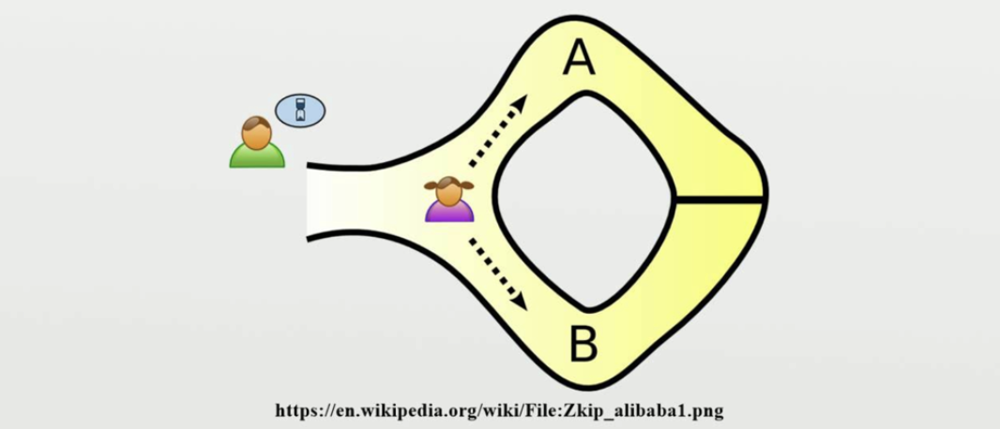

## ゼロ知識証明
ある知識を持っていることを、その知識に関する何の情報も明らかにすることなく証明する手法のこと。

VはPにお金を払って合言葉を教えてもらいたいが、Pには必ず真の合言葉を教えてもらいたい（Pが嘘をつく可能性がある）。逆に、Pが先に合言葉を教えるとVはお金を払わない可能性がある。このリスクを取らないために、Pはまず自身が合言葉を本当に知っていることだけを証明したい。そうすることでお互いに上手く取引をしたい。
つまり、Pは合言葉を教えずにVに本当の合言葉を知っていることを示したい。

### 証明方法
1. Pはどちらかの入り口から洞窟に入る（コミットメント)
2. Vはどちらかの入り口をランダムに選び、そこから出てくるようにPに指示する。
3. PはVに言われた方の出口から出てくる。
4. これを繰り返す。

### Pが本当は合言葉を知らない場合
PがVに言われた出口から出てこれる確率は、試行回数をnとすると(1/2)^nとなり、試行回数が大きくなると漸近的に0に近づきます。
よって、本当の合言葉知っていることを確率的に証明できますが、PはVに「合言葉を知っているかいないか」という1bitの情報しか与えていません。

### Pが合言葉を知っている場合
試行回数nに関わらず、必ずVの要求通りに洞窟から出てくることができる。

## zk-SNARKs
zk-SNARKs というのは、非対話ゼロ知識証明の構築方法の一つです。

wikipediaによると
> ある人が他の人に、自分の持っている（通常、数学的な）命題が真であることを伝えるのに、真であること以外の何の知識も伝えることなく証明できるようなやりとりの手法である。

とあります。少しわかりにくいのでもう少し具体的に書いてみます。例として、本人確認の文脈に絞ると、以下のように言って良いと思います。

自分自身であることを他の不要な情報を送らず(知られず)に証明することができる手法

### 非対話ゼロ知識証明とは
上記の零知識証明を"非対話"にしたバージョンです。

洞窟の例では、登場人物は何度かやりとり(対話)を行って証明を構成していました。非対話零知識証明では構成時にこういった対話が不要になります。対話が不要になるということは通信が不要になるということです。

　「じゃあ、それはどうやるの？」という話ですが、その理論的背景を zk-SNARKs を使って本記事で行っていく予定です。zk-SNARKs は非対話零知識証明の構築方法の一つです。zk-SNARKs 自体についてはZCashの解説にも詳しく書かれています。

### 以降の参考資料

[非対話零知識証明 zk-SNARKs の解説良記事を数学的ハードルを下げつつ日本語で解説していく Part-1/7](https://qiita.com/nrnrk/items/693e0444f528ef6aa6b3)

[zokrates](https://zokrates.github.io/)

[Meetup #1: Demystifying Zero Knowledge Proofs: How To Build A DApp Using zk-SNARKs (w/ speakers from 0x & Beanstalk)](https://medium.com/dystopia-labs/dystopia-labs-meetup-1-demystifying-zero-knowledge-proofs-how-to-build-a-dapp-using-zk-snarks-3e8529812a44)
