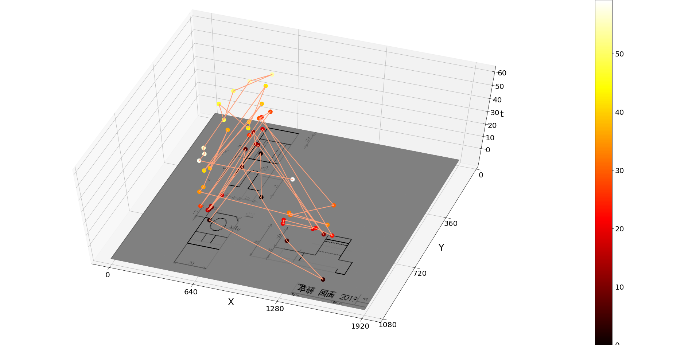

## 導入
卒業研究の過程で3D散布図を作ることになった．

具体的にはアイトラッキングの研究の際に，PC画面に画像を表示させ被験者に一定時間見せた時の視線のx座標，y座標，時間tの3次元データ(csv）を元に散布図を作るときに底面（x，y面）に，見せていた画像を表示させるとわかりやすいと思ったのがきっかけである．

しかし，いくら探せど日本語の記事が見つからなかったので（2Dグラフの背景画像挿入は簡単みたいでいくつか記事は見つかった），今回筆をとった次第である．
>>謝辞 : Twitterでアドバイスをくださった先輩方にこの場を借りて心から感謝したい．

## 対象者・救える人
3Dグラフ（散布図でなくても）を作る際に，底面(ひいてはx,y平面に水平)に任意の画像を表示したいという方．

## 動作環境
anacondaで環境構築すれば全て標準でインストールされている．
- python : 3.7
- matplotlib : 3.1.0
- pandas : 0.24.2
- numpy : 1.16.4
- 同ディレクトリにPythonファイルとcsvファイル，画像ファイル(2018.png)を配置

## コード
```momosuke.py
# 諸々のモジュールのインポート
import pandas as pd
import numpy as np
import matplotlib.pyplot as plt
from mpl_toolkits.mplot3d import Axes3D
from matplotlib import cm
from matplotlib.ticker import LinearLocator, FormatStrFormatter
from matplotlib._png import read_png
from matplotlib.cbook import get_sample_data
from pylab import *

# col_namesでカラム名を指定してcsvファイルを読み込む　*
col_names = ['x', 'y', 't']
data = pd.read_csv('kisisan.csv', names=col_names)

# 分かりやすいようにそれぞれ配列へ格納（自分がpython初心者のため）　*
listX = data["x"]
listY = data["y"]
listT = data["t"]
# データ数がめちゃ多かったので100ごとにスキップして再格納　*
listX = listX[::100]
listY = listY[::100]
listT = listT[::100]

# 3Dグラフを作る時のテンプレートみたいなもの（ax＝のところの書き方は複数あるっぽい)
fig = plt.figure()
ax = Axes3D(fig)

# 挿入画像を読み込む
fn = get_sample_data("/Users/momosuke/eye-tracking-for-efficiency-improvement-of-transfer/2018.png", asfileobj=False)
arr = read_png(fn)

# 画像を挿入（1094000000のところは挿入するZ座標．0など任意の値にどうぞ）
X1, Y1 = ogrid[0:arr.shape[0], 0:arr.shape[1]]
ax.plot_surface(X1, Y1, np.atleast_2d(1094000000), rstride=5, cstride=5, facecolors=arr)

# メインの散布図を挿入　*
p = ax.scatter(listX, listY, listT, s=100, alpha=0.8, c=listT, cmap='hot', label='eye-position')
fig.colorbar(p)
ax.plot(listX, listY, listT, linewidth=3, color='lightsalmon')

# 各座標軸のラベルの設定
ax.set_xlabel('X')
ax.set_ylabel('Y')
ax.set_zlabel('t')

# 描画
plt.show()
```

## 実行結果


## 注意点
- コード中で#での説明文の右に`*`が入ってるのは散布図に関するコードなので本題の画像挿入には関係ないので適宜無視して活用してほしい．

- コード中の`get_sample_data()`で指定するパスは**相対パスではなく絶対パス**にすることを推奨する．相対パスにすると`FileNotFoundError: [Errno 2] No such file or directory: '/Users/momosuke/anaconda3/lib/python3.7/site-packages/matplotlib/mpl-data/sample_data/2018.png'`というエラーを吐かれる．要は相対パスを使いたいなら，`~/sample_data`に対象画像を置いてそれを参照してくれみたいなこと．

- この記事は画像挿入する方法を与えるものでグラフの細かいパラメータ設定は省いてるので詳細部は各々で調整してほしい．

## 参考文献
- [Image overlay in 3d plot using python](https://stackoverflow.com/questions/13570287/image-overlay-in-3d-plot-using-python)
- [Matplotlib: Show Backgroundimage in 3D Graph with plot_Surface](https://stackoverflow.com/questions/47744942/matplotlib-show-backgroundimage-in-3d-graph-with-plot-surface)
- [Python 3.7.4 ドキュメント](https://docs.python.org/ja/3/)
