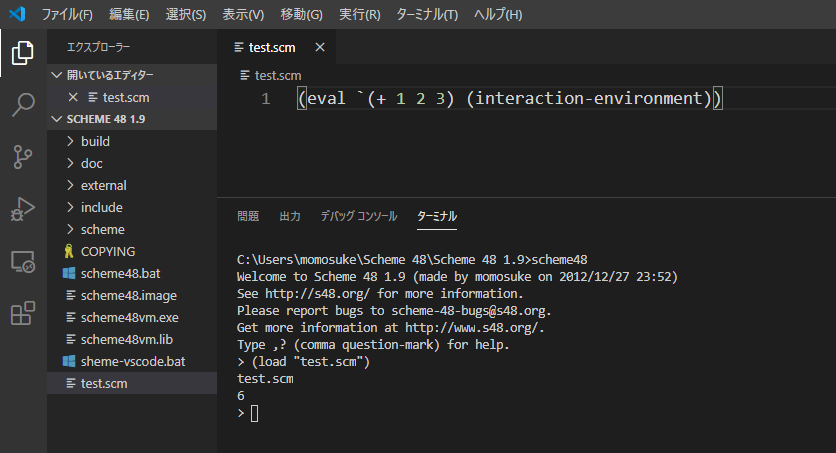

## はじめに
プログラミング言語論の授業でlispの方言であるschemeとその処理系であるscheme48を扱うことになった．

のだが，環境構築済みを謳うリモートアクセス先がこれまた重い，重い．

ので自分で自宅デスクトップ（windows10）に環境構築しようと思ったがいろいろ選択肢があって悩んだ．末に手軽な1つに決めて構築が完了したので，lisperでも何でもない私が初心者向けで手軽で使いやすい環境構築のすゝめを出そうと思った．

## scheme48のインストール
[scheme48公式](http://s48.org/1.9/windows.html)からwindows用のインストーラーをダウンロードしてください．

インストール先のデフォルトは

`c:\Program Files(x86)\Scheme 48\Scheme 48 1.9\scheme48`

ですが，そこに置くとセキュリティ云々で工数増えるし面倒なので，普通に

`c:\Users\ユーザー名\Scheme 48\Scheme 48 1.9\scheme48`

にしましょう．

この段階でコマンドプロンプトで

```
scheme48
```

とうって処理系が起動できたことを確認してください．

## （おまけ）VScode設定
ここからは使いやすいようにするための追加設定をしていきます．  

今回はVScodeを使います．ここが僕の悩んだところで，僕も関数型言語は初めてだったりemacsやvimの操作にはあまり明るくないビギナーなのでこれを機にいろいろと勉強しようかなと思ったんですが授業で課題もそうそうに出てて，あんまりもたもたしてられないので今は使い慣れたもので環境を作ろうと思ったのでvscodeを使います．

vscode上で`ctrl`+`shift`+`p`から`Preferences: Open Keyboard Shortcuts (JSON)`に進んでください．

`keybindings.json`にて以下をコピペしてください．

```keybindings.json
[
    {
        "key": "ctrl+j",
        "command": "workbench.action.focusActiveEditorGroup",
        "when": "terminalFocus"
    },
    {
        "key": "ctrl+j",
        "command": "workbench.action.terminal.focus",
        "when": "editorFocus"
    }
]
```
> @hassaku_63 さんの[VSCodeでエディタ画面とターミナル間のフォーカスを楽して移動したい](https://qiita.com/hassaku_63/items/4d14d949c3ce9edd9909)
のコードを参考にさせていただきました．

これで`ctrl`+`j`でエディターとターミナルを相互的にフォーカス移動できるようになりました．

::: tip
もちろん，トリガーとなるキーペアは自由に設定してもらって構いいません．
:::

するとこんな感じにコーディングから処理が手短に済みます．



## おわりに
あと，作りたい人はマクロでも組んでみたらさらに効率揚がるんじゃないかなと思います．

emacsはほぼノータッチなのでどっかで勉強しなきゃなぁ．．．