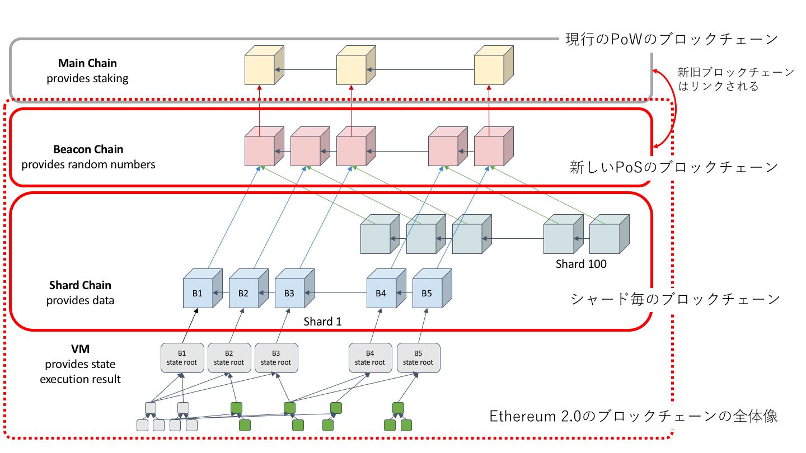

::: tip

以下の記事を引用してまとめた個人的メモ(引用先はサーベイに伴い随時追加)\\

[Ethereumの処理能力を向上させるSharding（シャーディング）](https://gaiax-blockchain.com/sharding)\\

[シャーディングがイーサリアムのスケーラビリティ問題を解決する理由](https://zoom-blc.com/sharding-ethereum)\\

:::

## 前提
Ethereumの1秒間に処理できるトランザクションは7-15程度．\\
VISAは秒間56000．大きな差がある．\\

Vitalikは2015年にはブログでシャーディングによるスケーリングの向上を言及

2018年4月にはシャーディングのプルーフ・オブ・コンセプトを示した．

## シャーディングの概要と枠組み
検証ノードを「シャード」と呼ばれるグループに分けて，グループごとのシャードチェーンで分担してトランザクションと関連するステートの処理を行う．\\

### シャードの中身
シャードでのトランザクショングループはヘッダーとボディーに分かれ，ヘッダーにはシャードのデータと取引承認の署名(Signature)が入る．\\

シャードデータには，シャードIDと，シャード間をつなぐためのレシートのマークル木，そして取引が適用される前後の状態のマークル木などが含まれる(レシートはトランザクションのログ情報)．\\

### メインチェーンへの影響
メインのブロックチェーンレベルでは，通常のブロックに加え状態(state)のマークル木ルートと上述のトランザクショングループのマークル木ルートが加わっている．\\

トランザクショングループで正しい取引が行われ，かつ完全に承認された場合のみ，そのトランザクショングループは有効化されるようになっている．\\

つまり，それぞれのブロックに状態のマークル木ルート(state root)とトランザクショングループのマークル木ルート(Transaction group root)が加わっただけでブロックチェーンの枠組みは変わっていない．

2018年夏．シャーディングとは別に進行してた**Casper**と呼ばれるPoSへの移行を一緒に進めようという流れ．

現在のEthereum Metropolisの次のSerenityでPoSに移行し，新しいブロックチェーンにシャーディングを導入する予定となった．この一連の計画をEthereum2.0という．

## シャード間のコミュニケーション
それぞれのシャードで，それぞれのシャード内に含まれる取引の計算と承認が行われてもシャード間でのデータのやり取りができないとネットワークとして機能しない．シャード間のコミュニケーションは**レシート(Receipt)**のやり取りによって行われる．\\

### レシート(Receipt)
このレシートは，それぞれの取引に基づいて作られ他のシャードから見ることができるが改ざんはできない様になっている．レシートをシャード間で取引データとしてやり取りすることでコミュニケーションを行っていくという仕組み．\\

また，セキュリティ的な理由により，シャーディングはPoSを実装した後に導入するべきだと考えられている．

## シャーディングにPoSが必要な理由
シャーディングは，すべてのノードがすべてのトランザクションの検証作業を行うのではなく，複数のノード群でトランザクションの検証作業を役割分担していくことだった．つまり，それぞれのシャードごとに状態が異なり独立して成り立っている．\\

なので，少ないマイナーのハッシュパワーによってセキュリティが維持されているノードに対して，攻撃が簡単になってしまうという問題がある．\\

例えば，シャードAとシャードBという2つのシャードに分かれて検証作業を行っているとします．そして，シャードAが全体の10％のハッシュパワーを持っていて，シャードBが90％のハッシュパワーを持っている場合，シャードAに対してはたった5.1%のハッシュパワーで51％攻撃が可能になってしまう．\\

つまり，PoWではセキュリティを維持しながら，マイナーが独立帝に働くかデザインすることが難しい(シャードごとにブロックチェーンが分かれているのではなく，ただ「状態」が異なるだけであることに注意)．\\

これをPoSで上記のような攻撃を防ぐことが可能．\\

イーサリアムで考えられているPoSのプロトコルでは，掛け金をデポジットしているバリデーター群をそれぞれのシャードごとに割り当てるだけでいいからである．\\

PoWではノードの計算を終えたマイナーがブロックを生成するので，実際にマイニングが成功するまでは匿名化されている状態といえる．そして，マイナーは自分の意志で℃のシャードで働くかを選択することができてしまう．\\

一方，PoSではあらかじめ掛け金をデポジットしている有効なバリデーター群が分かっているので，それらをシャードの規模に合わせて適切に担当を割り当てていくことができる．つまり，バリデーターは自分の意志でシャードを選択することができず，ただアルゴリズムに従うことになる．\\

このようにシャーディングの前にあらかじめPoSを導入していれば，セキュリティを維持しながら実装することができるので，シャーディングはPoSが前提の技術であると考えられている．

## Ethereum2.0でのシャーディング

Beacon Chainを中心にShard Chainを含む無数のブロックチェーンの集合とみなせる．

なお，Ethereum2.0ではPoSが想定されているので検証ノードはステークとして32ETHをデポジットして検証ノードのプールに参加する．\\

脆弱なシャードができないように検証ノードは定期的にシャッフルされランダムなシャードに振り当てられる．\\

個々のシャードでは独自のブロックチェーンであるシャードチェーンが進行する．ビーコンチェーンに対してブロックを提案し，Commiteeと呼ばれる検証ノードの委員会の承認を経て，ビーコンチェーンに取り込まれる．ビーコンチェーンの情報も定期的にシャードチェーンに伝搬される．メインチェーンとシャードの動機については，Vitalikが以下の資料で解説している．

[Cross-links between main chain and shards – Sharding – Ethereum Research](https://ethresear.ch/t/cross-links-between-main-chain-and-shards/1860)

## シャーディングの課題
EthereumにPoSとシャーディングが導入されると，ネットワークの中央集権化が進むのではという指摘がある．

## シャーディングの今後

シャーディングのロードマップがGitHub上に公開されている．

[Sharding roadmap · ethereum/wiki Wiki – GitHub](https://github.com/ethereum/wiki/wiki/Sharding-roadmap)

PoSのためにビーコンチェーンの導入から始まり，最下層のステートを扱うEVMを除いたシャーディングの導入，EVMも含むシャーディングの導入と進んでいくらしい．\\

EthereumがWorld Computerになるのはいつなのか．．．