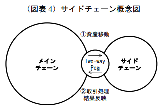
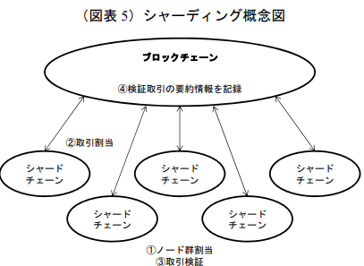

::: tip

以下の記事を引用してまとめた個人的メモ(引用先はサーベイに伴い随時追加)

[2] Eric Lombrozo, Johnson Lau, and Pieter Wuille, “Segregated Witness (Consensus layer)”, 2015

[Ethereumの処理能力を向上させるSharding（シャーディング）](https://gaiax-blockchain.com/sharding)

[シャーディングがイーサリアムのスケーラビリティ問題を解決する理由](https://zoom-blc.com/sharding-ethereum)

:::

## 前提
ブロックチェーン技術は決済・金融分野での活用が展望されている．

パブリックチェーンは拡張性に乏しく，処理遅延への対処が難しい．当初はブロック容量とブロック生成感覚に関する制約を緩和することで，処理能力を高める手法が用いられた．

しかし，ブロックチェーンのハードフォークや文献構造の交代といった問題が発生．

## スケーラビリティへの対処法の概要
- ブロックチェーンの外に一部取引を移管する手法（オフチェーン・スケーリング）
- 既存のブロックチェーンから新たに構築したブロックチェーンに資産を移管し取引を処理する手法（サイドチェーン・スケーリング）
- 検証対象取引と検証参加者（ノード）を複数のグループに分割し検証作業を分担する手法（シャーディング）

などが挙げられる．

## パブリックチェーンにおける拡張性のジレンマ
パブリックチェーンでは，情報を検証・記録する参加者を多数確保することで，特定の管理者や参加者間の信用に依存することのない分権的な枠組みを実現することが想定されている．

そのため，障碍や改ざんへの体制が相対的に高く，様々な分野への応用が期待されている．
- 決済・金融サービスにおける資産の記録・移転
- 各種契約の締結・履行

一方，不特定参加者が参加して情報を共有・記録するので，処理性能の制約や仕様変更時等に必要となる関係者間の合意形成（ガバナンス）の難しさなど課題もある．

ただ，パブリックチェーン上での円滑な運用のためには処理性能の拡張性は重要な問題である．

## スケーラビリティ概要
ビットコインやイーサリアムではブロックに記録可能な情報量に実質的な上限が設定されているために処理能力の面で課題がある．主な原因は以下である．

- ブロック容量の制約
- ブロック生成間隔の存在

また，ユーザーが自らの取引を優先的にブロックに記録させるためノードに支払う手数料を引き上げ，その結果，取引手数料が上昇するという副次的な問題も発生した．

この問題を解決するため上記2つの制約を緩和させて，時間当たりの処理対象取引を増やすことができる．

しかし，その一方で，ネットワーク帯域幅などの計算資源の大きい一部のノードの優位性が高まり，分権構造が後退する恐れがある（時間当たりの処理対象取引が増加すると，検証対象を短時間で処理できる計算資源の大きいノードの優位性が高まりやすい．ノードの優位性には，計算資源のほかに，他のノードとの接続形態やノードの稼働時間なども影響する）．

## これまでに実施された対処
- ブロック容量の拡大
- ブロック生成間隔の短縮
これらはいずれも，既存のブロックチェーンにおける仕様変更を通じて処理能力の向上を図る取り組みであり，**オンチェーン・スケーリング**などと呼ばれている．

もっとも，仕様変更に関する参加者間の合意形成は容易ではなく，ハードフォークと，これに伴う混乱が生じてしまっている．また，ハードフォークによるノード数の減少に伴う分権構造の後退といった問題も発生した．

### ブロック容量の拡大
#### 1.単純なブロックサイズの拡大
ブロックサイズの拡大は，スケーラビリティ問題への対応としては概念的にもっとも単純的な手法であり，仕様変更に技術的なハードルが低いこともあり，取引が増加した局面で実施されている．

例えば，ビットコインでは，もともと1MBだったブロックサイズ上限を8MBに引き上げるために，既存の使用に変更を加えたビットコイン・キャッシュと呼ばれる構想が提案され，2017年8月に実現した．

問題点としては，上述の通り一部のノードが優位性を高めることによる分権構造の後退と，仕様変更時の合意形成手順の記載漏れによるハードフォークの回避を回避しにくいことが挙げられる．この点においても分権構造の後退が課題である．

それに取引量が増加するたびにブロックサイズを拡大することは根本的な課題解決になっておらず，一層処理能力の高いノードの優位性に対する懸念が高まると考えられる．

#### 2. ブロック内の構造変更によるブロック容量の拡大
ブロック容量の拡大を目的とした別の取り組みとして，ブロック構造の見直しを通じたSegregated Witness(SegWit)と呼ばれる仕様変更が挙げられる．

ブロックに格納される個々の取引情報には，取引を行ったユーザーを証明するための署名データが含まれているが，そのサイズは比較的大きいうえ，保管領域に関するセキュリティ面での課題を解消するとともに，ブロックに格納可能な情報量を拡大させる操作が提案された[2]．

最初は反対意見が多かった．

というのもスケーラビリティ問題が解決するとマイナーが得ることのできる手数料が減少すると見込まれてからである．また，SegWit対応の結果，利用不能となってしまうマイニング機器もあったのでマイナーから批判された．

しかし，SegWit導入によって署名管理に関するセキュリティが向上する利点が強く意識されるようになったり，オフチェーン・スケーリングの利用が展望された点もメリットとして受け止めれられた．最終的には，十分な支持が得られ，2017年8月に仕様変更により実装された．

ただし，SegWit利用に伴うブロック容量の拡大効果は一度限りに過ぎず，取引量が増えればまた圧迫される．このためブロック構造を見直す手法では，今後の拡張余地が限られていると考えられている．

### ブロック生成間隔の短縮
ブロック生成間隔を短縮させると，一定期間内で処理可能な取引量が増加するため，スケーラビリティ問題の緩和につながる．

ビットコイン・キャッシュでは2018年1月に，もともと約10分であった生成間隔の使用を変更し，ブロックを約2分で生成できるようにすることで，取引データの処理量を増加させた．

これに関しても，計算資源の大きい一部のノードの優位性が高まり，分権構造が後退する可能性がある．

## 次世代的な取り組み
上記であげてきたオンチェーン・スケーリングには，ハードフォークや拡張性の乏しさといった課題があるため，代替する手法の模索が続いている．

いずれも実装にあたってクリアすべき課題が今なお残されており，研究・試行段階にあるものの，アプローチに関する概念的な整理や技術面での進展も見られつつある．

ここではビットコインとイーサリアムを対象とした3つの取り組みをまとめる．

- ブロックチェーンの外に一部取引を移管する手法(オフチェーン・スケーリング)
- 既存のブロックチェーンから新たに構築したブロックチェーンに資産を移管し取引を処理する手法(サイドチェーン・スケーリング)
- 検証対象取引とノードを複数のグループに分割し検証作業を分担する手法(シャーディング)

### オフチェーン・スケーリング
すべての取引をブロックに格納はせず，一定期間内に実行された複数の取引をネットアウトし，その結果のみをブロックチェーンに記録すれば，処理対象となる取引情報量を削減できる．

このアイデアを実現するために「ペイメントチャネル」と呼ばれる仕組みをブロックチェーンの外に設け，ここで両者間の取引をネットアウトする取り組みが提案されている．

ビットコインやイーサリアムの場合，それぞれのユーザーは
1. 双方の署名によってのみ管理可能な講座（マルチシグアドレス）に，自らの取引ニーズに応じた規模の資産を預託し，
2. 取引相手との間でペイメントチャネルを解説する．ユーザーは
3. 預託資産を上限に，ペイメントチャネルで接続されたユーザーに資産を送付できるほか，取引相手のユーザーから資産を受け取ることもできる．ペイメントチャネルが解説された期間中のユーザー間取引は，何度行われてもブロックチェーンに記録されることはなく
4. ペイメントチャネルを閉鎖すると
5. それぞれのユーザーは資産を引き出すことができ，この間の取引をネットアウトした最終的な結果のみがブロックチェーンに記録される．

::: tip
ブロックチェーンには，1．ペイメントチャネルの解説は双方のユーザーからのマルチシグアドレスへの送金，
:::

代表例としてビットコインのLightning NetworkやイーサリアムのRaiden Networkと呼ばれる手法がある．

メリットとして以下が挙げられる．

- ブロックチェーン上では取引の記録に一定の時間がかかっていたが，ペイメントチャネル上では速やかに処理されることから，取引の高速化が期待できる．
- 取引手数料に関して，ペイメントチャネルの開設・閉鎖に要する費用と，送金時に経由するユーザーから課金される手数料以外は不要となるため，取引増加時に送金コストが上昇しがちなブロックチェーン取引に比べて費用を節約できる．

デメリットとして以下のことが挙げられる．

- ペイメントチャネル開設に伴って預託負担が発生するため，規模の大きい取引を機動的に実行しにくい
- 預託する資産を多く持つユーザーが多数のユーザーとペイメントチャネルを開設すれば，同ユーザーは取引の軽油先として中心的に利用されるようになり，分権構造が後退するリスクがある
- 上の場合にハブとなるユーザーの障害と雲丹より，ネットワークの可用性が低下する可能性がある

以上を踏まえてブロックチェーン上の取引とペイメントチャネル上の取引を使い分ける必要がある(早期の取引処理が必要なしょいうきぼ取引を手掛けるユーザーにとってはイイ)．

### サイドチェーン・スケーリング
ブロックチェーンの外へ新たに別のブロックチェーンを構築し，スケーラビリティ問題の緩和を図る試み．

1. メインチェーン上の資産をサイドチェーン上に移動
2. サイドチェーン上で実施された当該資産の取引結果をメインチェーンに反映

双方のブロックチェーン間を円滑・安全に往来できる環境を確保する昨日を**Two-way Peg**と呼ぶ． 

ブロックチェーン間で資産を移動させる手法としては，単一の管理者が一方のチェーンで資産を預かり，もう一方のチェーンに移動させる仕組みが考えられる．

しかし，同管理者が悪意を持って改竄を行うリスクが排除できないといった課題があるため，複数の管理者による相互監視の仕組みが提案されている．

もっとも，こうした仕組みを採ったとしても，管理者の数が限定される限り，取引検証の分権構造が確保されにくい（管理者の共謀による改竄を排除できない）という難点がある．

#### オフチェーン・スケーリングと比べた利点
オフチェーンスケーリングでは，ペイメントチャネルごとに資産の預託が必要であり，大口取引が機動的に実行されにくかった．サイドチェーンではこうした制約が無く，規模の大きな取引も行われやすくなる．

取引所のような大きなノードは，大口取引の遅延に伴う決済リスクの負担や，取引手数料の上昇がとりわけ重要となる．こうしたノードにとってはサイドチェーンは魅力的に受け止められる．

### シャーディング
1. ノード群を定期的に入れ替えながらランダムに複数のグループ(シャードチェーン)に分割
2. これらに検証対象取引を割り当てる
3. 取引検証作業を分担
4. ブロックチェーン上に検証取引の要約情報を記録する

イーサリアムへの応用が代表事例だが，実用化には至っていない．

オンチェーン・スケーリングでは，同様の手法を繰り返す必要がある．

本手法では，ブロックチェーン全体において，一度大幅な仕様変更が必要ではあるが，それを乗り越えれば，将来の取引量増加に対応する拡張性が確保される可能性がある．

メインチェーンには，個々のシャードチェーンで検証された取引の要約情報のみが記録されることになるため，スケーラビリティ問題の解決につながる．

#### サイドチェーン・スケーリングに比べた利点
サイドチェーン・スケーリングでの課題であった，取引の検証における問題(ノードの悪意を持った振る舞い)についても，ランダムに選ばれなおされるノード群が情報の移転機能を担うことから，特定のノードに懸賞を依存する事態はある程度回避される設計となっている．

こうした機能を十分に発揮するためには，シャードチェーン内の特定ノードの優位性が不正に直結しにくい環境を実現する必要がある．イーサリアのシャーディングにおいては，ノードが事前に差し入れる資産の大きさに応じて検証成果が向上するPoSが検討されている．

ただ，大きな資産を持つノードはより多くの資産を獲得し，一段と検証成果を高める傾向があるため，分権構造が後退する恐れが残る．また，資産差し入れに伴い，市場で取引される当該資産が減少すると，市場流動性の低下や効率的な価格形成が阻害される可能性もある．

対処としてデポジットの最低金額を引き下げることで，資産力のあるノードの独占力の緩和を図る工夫や，ノードによってデポジットされた資産が取引可能になるまでの期間を短縮化し，流動性の改善を図るといった対応も検討されている．
