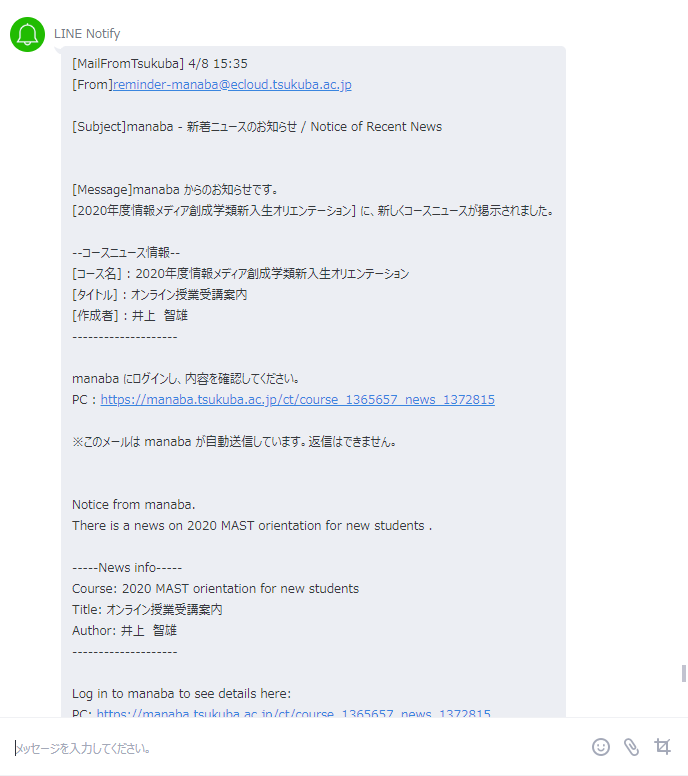
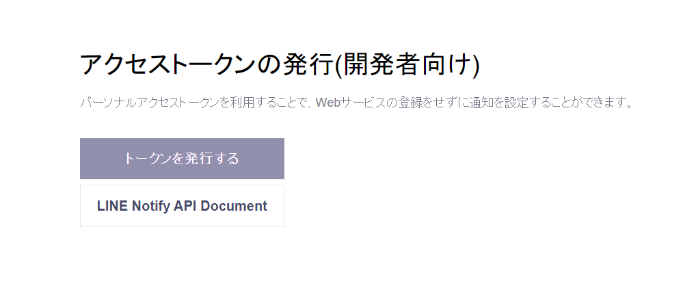
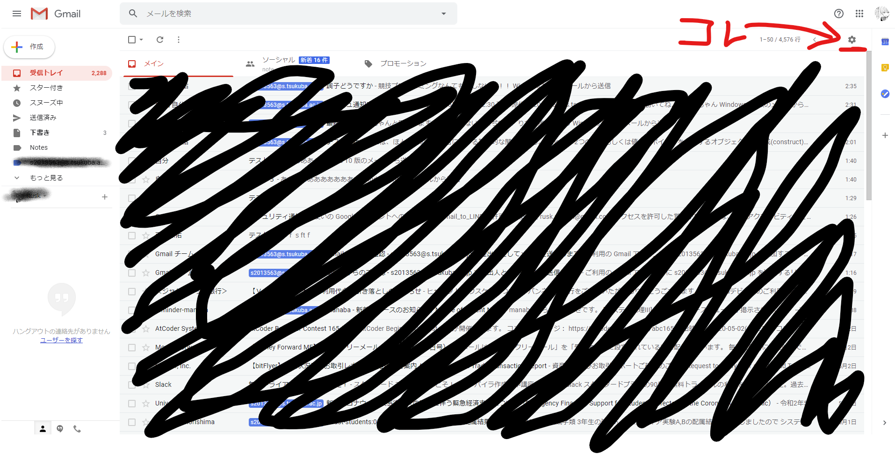
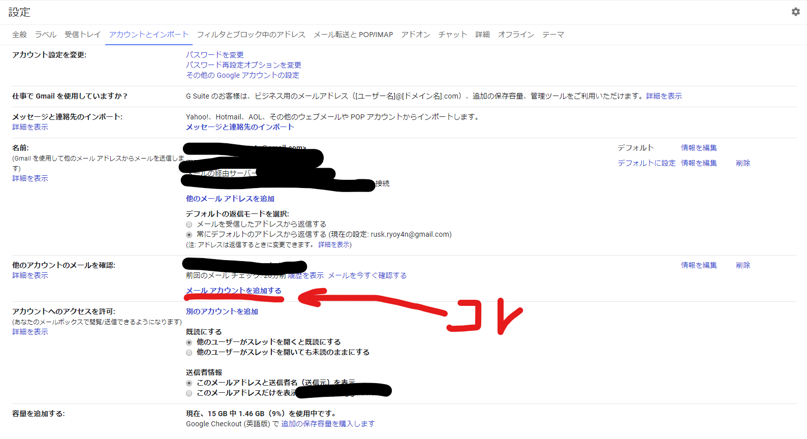
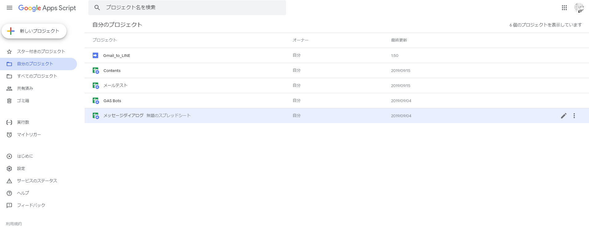
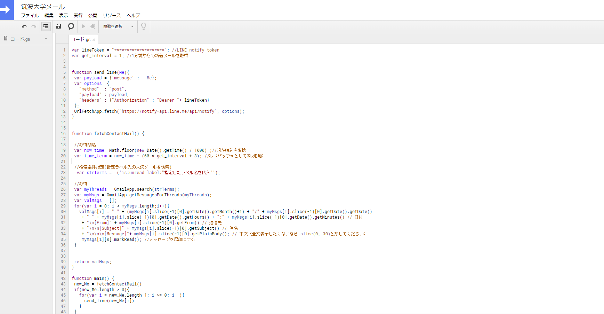
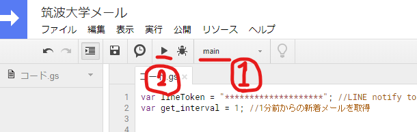
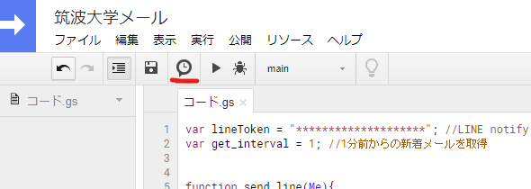
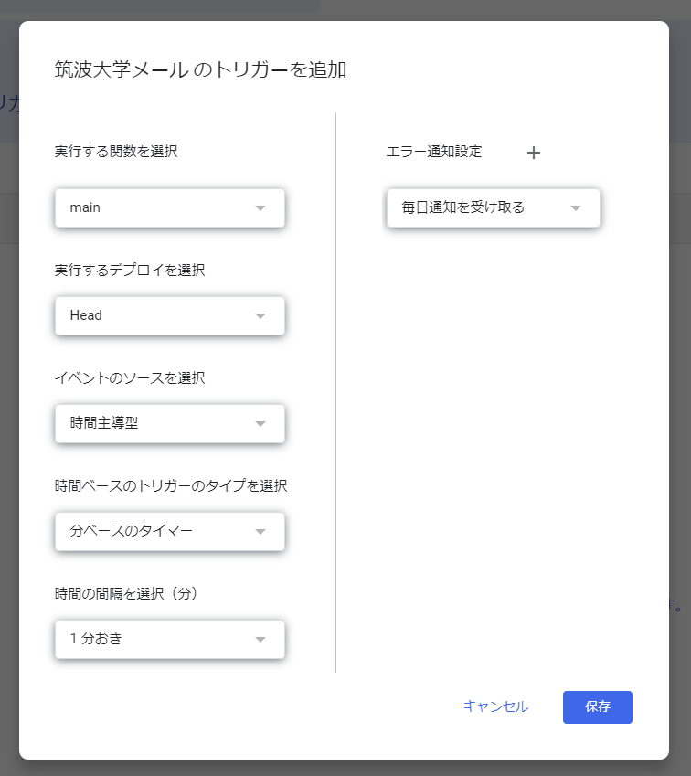

## アブスト（飛ばしていい）
今年から筑波大学に入学していきなりコロナでオンライン授業になった．  

manabaで授業関連の情報が流れてくるが，僕が使ってるiphoneという電子端末は数時間おきにまとめてメールの通知を寄こしてきやがる．ので僕は困った．リアルタイムでメール通知が欲しいと思った次第．

## 情報系の人へ
Qiitaに記事をこの記事ほどかみ砕いていないものをアップしたので**こんな長々とした文章には辟易するぜ**マンは以下の記事をどうぞ．  

[大学（会社）から来るメールがLINEに来れば良いと思うんだけど君はどう思う？](https://qiita.com/drafts/3497f65baa18c0307c7e/edit)  

一部の過激派から「**おいおい，LINEなんてパンピーが使うアプリに通知ながすのかい？ボーゥイ？せめてSlackかweChatだろぉ？**」なんてヤジが飛んできても無視します．

## やることリスト
0. LINEトークンを発行して，通知を流すグループを作る
1. 大学からのメール(office)をGmailにインポートしてラベリングする
2. GASでメールを検知してLINEへ発出

## 0. LINEトークンを発行して，通知を流すグループを作る．
まずはLINE上で通知を流すためのグループを作ってそこにLINE Notifyを招待してください．  

::: tip
グループじゃなくて1:1で通知するオプションも選べます．その場合LINE Notifyとのトークとして通知が来ます．
どっちがいいかはヴィジュアルの好みによるし，この後の作業にまったく影響しないので任せます．
:::

次に[LINE Notify](https://notify-bot.line.me/ja/)にアクセスしてお使いのLINE IDでログインしてください．  
ログインしたらマイページにて「トークンを発行する」から作成したグループを選択の上トークンを発行してください．その際に表示されるトークンをあとで使います．




## 1. 大学からのメール(office)をGmailにインポートしてラベリングする
お使いのGmailを開いてください．デスクトップでもWebでも構いません．  
そしたら右上の歯車マークから**設定**を開いてください． 



「アカウントとインポート」欄の「他のアカウントでメールを確認」から「メールアカウントを追加する」を選択してください．



そうするとアカウントを追加するウィンドウが表示されます．

1ページ目：大学メールアドレスを入力  
2ページ目：「他のアカウントからメールを読み込む（POP3）」を選択  
3ページ目：パスワードを入力．チェック欄は最後以外にチェックを付ける．ラベル名をつける（重要）  
その後のページはデフォルト設定or推奨オプションを選択で上手くいくと思います 

::: danger
あとでスクショ用に改めてメアド追加しようと思ったらウィンドウの形式が違いました．なので以前にもアカウントを追加したことがあるかどうかなど，個人の環境のよって出てくるウィンドウが違うかもしれません．しかし重要なのは「**ラベル名を付けること**」なのでそれ以外はデフォルトでまず問題ないと考えられます．
:::

これでGmailを開くと指定したラベル名でメールアカウントが追加されてると思います．

> 注意！！！Gmailへのインポートが完了したら現時点で来てるメールをすべて**既読**にしてください．今回のプログラムは未読メールを検知してLINEに通知して既読にするまでを行いますので．

## 2. GASでメールを検知してLINEへ発出
[GoogleAppScript](https://script.google.com/)にGmailと同じアカウントでログインしてください．

https://script.google.com/ ←リンク



左上のボタンから新しいプロジェクトを開いてください．

開いたら，元からあるコードを消して，以下のコードを貼り付けてください．

::: warning
1行目はさきほど発行したトークに置換してください．  
23行目の「指定したラベル名を代入」のところはあなたが指定したラベル名に置換してださい．
:::

```コード.gs
var lineToken = "********************"; //LINE notify token
var get_interval = 1; //1分前からの新着メールを取得


function send_line(Me){
 var payload = {'message' :   Me};
 var options ={
   "method"  : "post",
   "payload" : payload,
   "headers" : {"Authorization" : "Bearer "+ lineToken}  
 };
 UrlFetchApp.fetch("https://notify-api.line.me/api/notify", options);
}


function fetchContactMail() {

 //取得間隔
 var now_time= Math.floor(new Date().getTime() / 1000) ;//現在時刻を変換
 var time_term = now_time - (60 * get_interval + 3); //秒（バッファとして3秒追加）

 //検索条件指定(指定ラベル先の未読メールを検索)
  var strTerms =  ('is:unread label:"指定したラベル名を代入"');

 //取得
 var myThreads = GmailApp.search(strTerms);
 var myMsgs = GmailApp.getMessagesForThreads(myThreads);
 var valMsgs = [];
 for(var i = 0; i < myMsgs.length;i++){
   valMsgs[i] = " " + (myMsgs[i].slice(-1)[0].getDate().getMonth()+1) + "/" + myMsgs[i].slice(-1)[0].getDate().getDate()
    + " " + myMsgs[i].slice(-1)[0].getDate().getHours() + ":" + myMsgs[i].slice(-1)[0].getDate().getMinutes() // 日付
    + "\n[From]" + myMsgs[i].slice(-1)[0].getFrom() // 送信先
    + "\n\n[Subject]" + myMsgs[i].slice(-1)[0].getSubject() // 件名
    + "\n\n\n[Message]"+ myMsgs[i].slice(-1)[0].getPlainBody(); // 本文（全文表示したくないなら.slice(0, 30)とかしてください）
    myMsgs[i][0].markRead(); //メッセージを既読にする
 }


 return valMsgs;
}

function main() {
 new_Me = fetchContactMail()
 if(new_Me.length > 0){
   for(var i = new_Me.length-1; i >= 0; i--){
     send_line(new_Me[i])
   }
 }
}
```




### テスト
ここまでの作業が上手くいってるかどうかを確認するためにテストをしてみましょう．

1. 自分で自分に（ラベルした大学メアドの方）メールを送る
2. GAS上でmain関数を選択の上，実行してちゃんとLINEが来るか確認

::: warning
1を行った後は素早く2を実行してください
:::



## いざデプロイ！！！
テストが上手くいったら，いよいよデプロイしていきます．

実行ボタンの左にある時計ボタンでトリガー（何分置きにこのプログラムを実行するのか・メールを探索するのか）を設定していきます．



ジャンプ先で右下の「**トリガーを追加**」をクリックしてください．
↓画像のように設定し「**保存**」をクリックしてください．



これでメールが来たらわざわざmain関数を実行せずとも1分おきにmain関数が実行され未読メールを探索してきてくれます．

## おわりに（雑談）
今年から筑波大学に編入して，分からないことばかりなのに内部生徒の繋がりを全く持てず孤独感を味わっている毎日です．  

早く内部生にあって「よろしく」言いたいです．たわいもない話や技術的な話で盛り上がりたいです．そういう環境的なものも含めて筑波大学には求めていたので，研究だけして卒業しそうな自分を憂いてます．

「僕はこんな人間だよ」的なものを置いとくので良かったらTwitter(@AnoTensai)で絡んでください．．．（気まぐれで鍵かけてるけど絶対フォロバします）

## 参考文献
[[Gmail to LINE]GASで新着メールをLINEに転送する](https://qiita.com/Damon/items/bbe6350ef1a4a10fe397)
