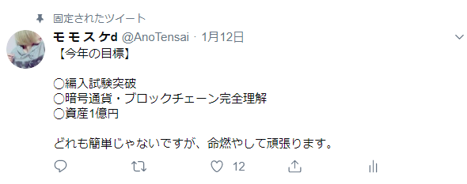

2019年，令和元年5月22日，僕モモスケは20歳になりました．いろいろな人たちに支えられここまで来れたとは思ってませんが周りの人にはとても感謝しています．

僕はここ1，2年でとっても変わった．18歳まではただの金の亡者で学歴コンプレックスでこれといって趣味のない人間だった．行きたい研究室もないのに可能性が見えたから東大を目指してみたり，なれない投資で疲弊したり，Pythonの文法と軽いスクレイピングを学んだだけでプログラマー気分に浸っていたり，企業したい！と口だけ達者．．．あぁそう．「意識だけ高い系」だった．

今では研究や教授単位で大学を志し，ある程度の金融資産も築けて，将来どう言った分野で起業してみたいのかも決まり，受験科目だったこともありプログラミングもアルゴリズムを１から学び，フロントエンドの勉強もした．最近は低レイヤーの勉強も始めた．まだまだだけど．

そして一番大きい変化だと思うのは，現状に満足せず嘆くことなくさらに学ぼうという姿勢を手に入れたことだと．

勉強することが苦でない．なんて2年前の自分では考えられない．授業は寝るか，スマホゲームして，放課後はバイト，帰ったら深夜までオンラインゲーム，からの寝不足で翌日の授業は（以下略）

なんでこんな買われたのか考えてみた．幸自己分析は得意だった．

原因は僕の性格の1つである「負けず嫌い」．意識だけ高い系の界隈にいながらもどこか，俺はこの人たちとは違うと思ってた．でも実際比べてみると実績や経験は特にない．僕もその他大勢の1人である事実との背反に苦しんだ．

そこで僕がとった行動は難しい本を買いまくることだった．意識だけ高いけいの人が苦手とすることの1つに読書が挙げられる．彼らはマインドだけ意識高い系のくせして，知識への貪欲さに欠ける．どうにか効率よく理のある情報だけを手に入れられないかと必死．効率主義を拗らせた人間は結果，悪効率を招く．

僕は2017年末の仮想通貨フィーバーで一発当てた金を削ってとにかく本を買いまくった．週5で本屋に通っていた時期もあったか．月3万以上は使っていた．

どんな本を買っていたかというと，哲学書だと「善悪の彼岸」や「大衆の反逆」，ビジネス書で言うと「起業の科学」，「京セラフィロソフィー」，投資関連で言うと「敗者のゲーム」，「株式投資の未来」，その他は「利己的な遺伝子」や「眼の誕生」などどれも素晴らしい本であり骨のあるものばかり．分野を問わず**良書**と呼ばれるものを端から集めた．

最初はとても苦しかった．何冊も途中で投げ出した．

そんな時ある本に出会った．

「バフェットからの手紙」．これは投資におけるメンタルを説いてるが，当時中途半端な知識で相場に挑んでいた自分にめちゃくちゃ刺さった．決して薄くない本だが，2日で読み終えた．ここからだ．本を読むことを楽に思えたのは．

結局2018年だけで**80冊**近く読んだ．

読書好きの人にとっても多いと思ってもらえる数字だと思うんですが，この直前まで活字本なんて部屋になくて1日8時間ゲーマーな人間がいきなり80冊読んだんだ．

マジで褒めてあげたい．

結果どうなったかって言うと，ものすごい知識欲を手に入れ，さらにマインドだけなら未来人になった．と思ってる．そこら辺の大人より考えれる人間になった．どんな些細なことでも，めちゃくちゃ考え込んでしまうようになった．

どういう感じか説明するのか難しいんですけど，1日何回もある**考え込み**の1例をあげてみる．

この前YouTubeで韓国の反日教育に関する動画をみた時にこんな感じに考え込むことがありました．（案の定コメント欄では大量の反韓コメント）

::: tip
「逆に日本では反韓教育してないのかな．例えばサッカーの代表戦で韓国が失点したら，他の国が失点するより喜んでる現状って実際あると思うんだけど，試合を見てる人の大半は政治に関する知識がないとすると，彼らは雰囲気で韓国に対して嫌悪感を持っているんじゃないか．そして韓国が悪い状況になると他より喜ぶわけですよね．なんでそんな雰囲気になるのかは自明なわけで．日々，ニュースで「韓国がまた悪いことをした！！遺憾の意を示す！」みたいな報道をたくさんしているからですよね．これは反韓教育じゃないのかな．かく言う僕も日韓戦には特別な感情を抱いてしまうからなぁ．19年間の人生で，しっかりテレビに反韓教育されてるなぁ．と感じてみたり．

でも，僕も政治に詳しくないから，ほんとに韓国が絶対悪で僕ら日本は正義で，この韓国に対する嫌悪感は全く正当なものであると言う可能性も捨てきれないよなぁ」
:::

みたいな感じで知識が追いついてないと答えが出ないことも多いんですけど，こんな感じで1日10回くらい考え込んでます．

 

なんだか話が逸れました．

と，過去はある程度書き連ねたので，未来について，これからについて自戒の意味を含めて書き連ねていきたい．

僕は1月に今年の抱負としてこんなものをツイートしています．

上2個はまぁいいとして，一番下の資産一億円っていう目標．僕は本気で書いたんですけど，結構な数の友人から，**「冗談だよね？」**と言われました．現実，1000万言ったら上々だなと思ってます．これまたでかい金額ですが，割と自信はある．

僕は編入試験後の半年でやりたいことは，大きく分けて4つ．

まず1つ目．**投資**です．元々やってましたが，編入勉強を始めてからは朝に価格チェックするだけ．拝金主義ではなくて．目的としては生活を豊かにするというより，無駄のない生活をしたいって感じです．モノを買う時に高いか安いかでなく，いいものか悪いものかを判断基準にしたい．身の回りのあらゆる不便を解消したい時にお金で渋ることを若いうちからなくしておきたいということ．

2つ目は**プログラミング**です．20歳のうちにサービスを作る経験をしたい．よくをいえば，去年からハマっているブロックチェーンを活用したものを．それには今までやってこなかった，サーバー側の知識やセキュリティ，コンピュータシステム理論なんかの知識も必要だと思うので，コーディングだけでなく，基本情報技術者やセキュリティスペシャリストの資格勉強もしたいと考えている．

3つ目は**金融・経済**です．投資と将来の起業のためにこれらの知識は外せない．覚えることが多そうですが，急がずゆっくり本を読んだ利してロングスパンで身につけていこうと考えている．

4つ目は**大学への前準備の勉強**です．僕のやりたい研究には光工学の知識が必須なので，電磁気をもう一度復讐し，後はフーリエ変換も忘却の彼方に放り投げているので，取り返しに行こうと．あとは某魔法使いに影響されてメディアアートもやりそうなので，芸術に使えそうな分野（流体力学や，材料力学）を緩く勉強したいと考えている．

半年でこんな！書いてみて達成できるか不安になってきた．でも大丈夫．苦ではないはず．これが古文や世界史に置き換わったとしたら，僕は途中で投げ出す．でもこれらは僕のやりたい勉強．

1日10時間？望むところです．上で書いた通り，マインドと知識欲はこれ以上ないくらい成長した．あとは知識．僕がニーチェ的な「超人」になるには圧倒的な努力によって幅広くさらに深い知識をゲトること以外ない．

書き忘れていましたが，将来何をしたいのかを書いてみる．

投資自体は生涯続けたい．ただ，ずっと画面に張り付いてトレードできるのはせいぜい学生の間だ．なので投資対象は変わるだろう．学生のうちにある程度の金融資産を手に入れ，利回りで毎年安定した収入があるような状態を目指したい．

大学の研究ですが，ざっくり言えば光の研究．っていうのもはっきり決まってません．てか興味がある分野が多い．VRもしたいし，ホログラフィックもやりたいし，超音波もやってみたい．

ただ将来，大学での研究を生かした，どんな企業を興したいかは決まってます．

分野はファッション×テクノロジーです．僕は勉強と同じくらい服が好きで．服に関しても深い思想を持っていると思います．日頃から，オシャレってなんだろうって考えてる．ストリートやボロルックなどジャンルの違いに果たして上下関係は存在するのかとか，この世にダサい服は存在しない説を勝手に提唱したりしてる．

元々服と科学につながりはないことはない．高尚なファッション界隈に限ることですが，有名ブランドでは，数学者を招いて美しい比率の図形や曲線を解説してもらいデザインに役立てている．

それとは違うんですが，僕がしたいの時間変化でデザインが変わる服の開発．

当たり前ですけど，服のデザインって買った時から変わらないです．だから，飽きたりするんですけど．

日替わりでデザインが変わる服があったらめちゃくちゃ便利じゃないですか．お洒落の幅も広がるし，節約にもなる．もちろん自分好みのデザインにもできますし，デザインを応用すれば，常に服の上でグラデーションウェーブが動いたりなんてことも可能です．

お洒落さんで研究者はまずいないですし，逆もまた然りです．だから，かなりブルーオーシャン（ライバルが少ない）と踏んでます．

まぁまだ夢の段階ですし，復職業界にとって服の需要が減るというデメリットもあるので，場合によっては風当たりが強くて潰される可能性もあるかもしれませんが，ファッション×テクノロジーでなにか社会実装をしたいと強く思ってます．

ただ同じくらいやりたいこともあって，それがブロックチェーンです．ブロックチェーンエンジニアになるための勉強は編入勉強を始める前から約3ヶ月ほどやりました．参考書も10冊弱こなしました．それくらい僕の中ではホットなんです．ブロックチェーン氏らいない人に説明するとビットコインなど仮想通貨に使われている革命的で割と最近急激に伸びている技術です．

なので欲張ってファッション×ブロックチェーンで何かできないかなって最近考えているんですけど，今のところいいアイデアはありません．

ファッションのインフラ的なZOZOみたいな企業なら，ブロックチェーンはいくらでも活用できると思うんですけど，僕がしたいのはあくまでもデザイン，お洒落な服を作ることなんでね．．．

好きなことを仕事にするのは時に難しいです．でもめっちゃワクワクしてます．好きなことしてて生活できる．そんな未来に僕は今，投資してます．